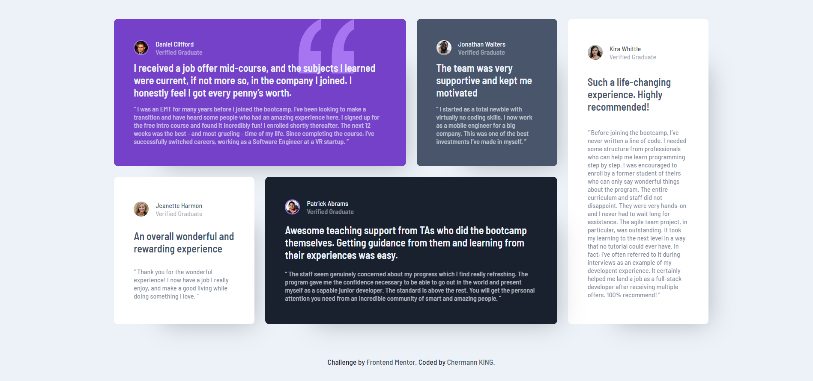

# Frontend Mentor - Testimonials grid section

This is a solution to the [Testimonials grid section](images\testimonials-grid-section-print-screen.png). Frontend Mentor challenges help improve coding skills by completing realistic projects.

## Table of contents

- [Overview](#overview)
  - [Screenshot](#screenshot)
  - [Links](#links)
  - [Built with](#built-with)
- [Author](#author)

### Screenshot

### Links

- Solution URL: https://github.com/Chermann-KING/testimonials_grid_section---JUNIOR
- Live Site URL: https://chermann-king.github.io/testimonials_grid_section---JUNIOR/

### Built with

- Semantic HTML5 markup
- CSS custom properties
- Mobile-first workflow

## Author

- Website - [Hermann MOUSSAVOU](https://hermann-moussavou.com)
- Frontend Mentor - (https://www.frontendmentor.io/profile/Chermann-KING)
- LinkedIn - (https://www.linkedin.com/in/hermann-moussavou)
